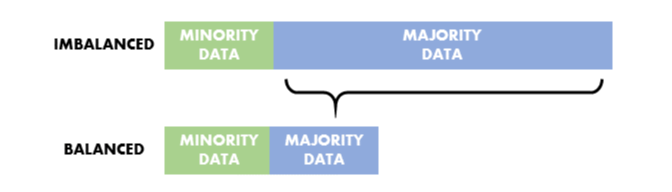
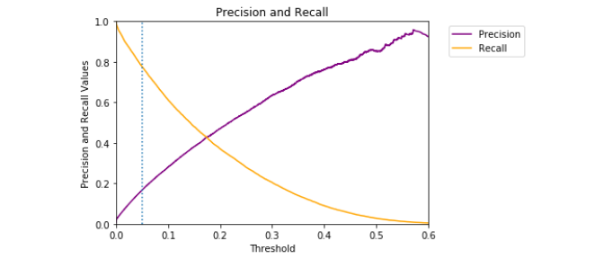
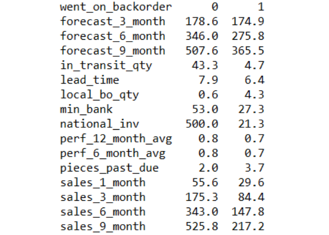
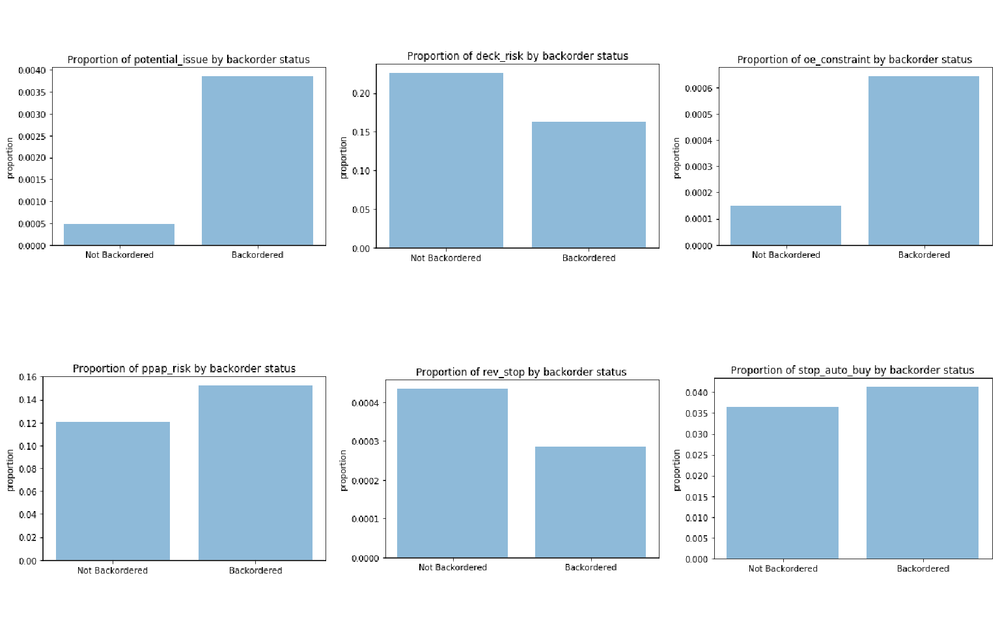
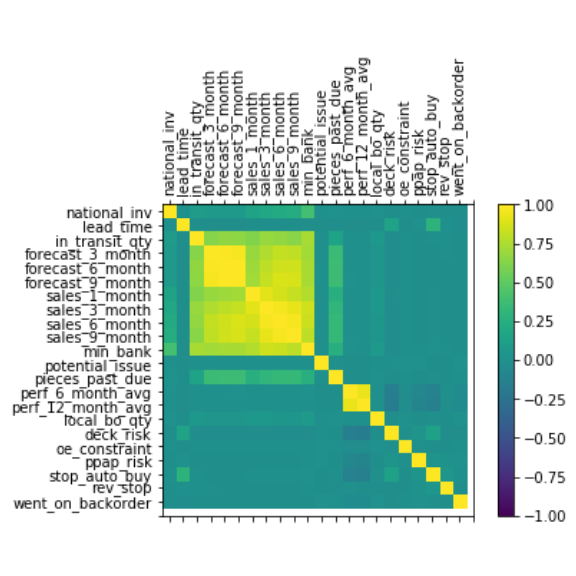
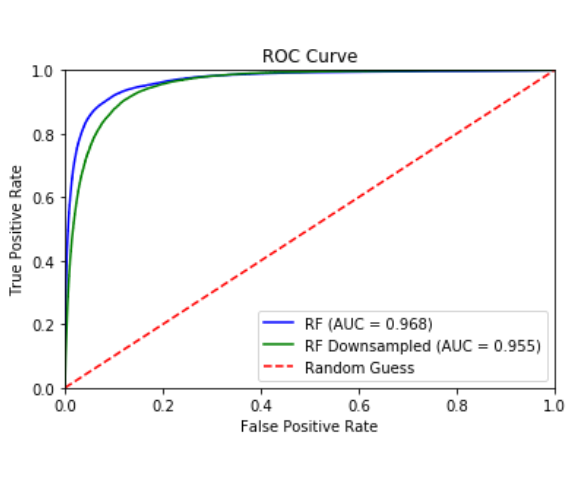
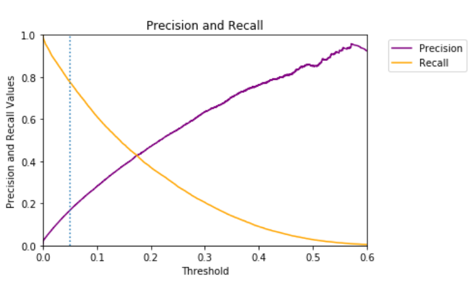
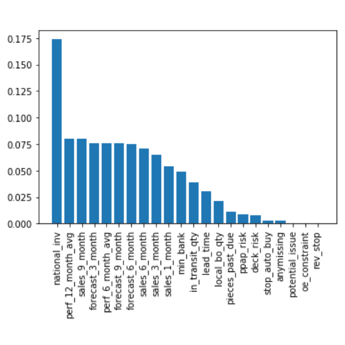

Backorder Prediction Modeling
================
Cooper Schumacher
November, 2017

| **Primary skills** | **Primary Programs** |
|--------------------|----------------------|
| Modeling           | Python               |

Background and Objective
========================

I am interested by advanced analytics related to supply chain, and decided to take on a modeling project to gain experience and better understand one particular challenge: **predicting whether a product will go on backorder**.

Product backorder may be the result of strong sales performance (e.g. the product is in such high demand that production cannot keep up with sales). However, backorders can upset consumers, lead to canceled orders and decreased customer loyalty. Companies want to avoid backorders, but also avoid overstocking every product (leading to higher inventory costs).

Data
====

I used [data](https://www.kaggle.com/tiredgeek/predict-bo-trial) from Kaggle, which had 1.9 million observations of parts in an 8 week period. The source of the data is unreferenced.

-   **Outcome**: whether the part went on backorder
-   **Predictors**: Current inventory, sales history, forecasted sales, recommended stocking amount, part risk flags etc. (22 predictors in total)

Modeling
========

### Key considerations of the data:

-   **Imbalanced outcome**: Only 0.7% of parts actually go on backorder.
-   **Outliers and skewed predictors**: Part quantities (stock, sales etc.) can be on very different scales.
-   **Missing data**: A few variables have data that are missing (not at random).
-   **n&gt;&gt;p**: There are many observations (1.9 million) relative to the number of predictors (22).

### Implemented Models

We made several modeling decisions to address these issues:

-   **Random forest** estimators are used
    -   **Perform well with imbalanced data typically**
    -   **Robust to outliers and the skewed predictors**: Because they are using tree partitioning algorithms and not producing coefficient estimates, outliers and skewness are not as much of a concern as for other predictive models.
-   **Down sampling**: to account for the imbalanced outcome, we try down sampling the data of parts that didn't go on backorder.
    -   We choose down sampling over other similar methods that resample the minority group (e.g. up sampling or SMOTE) as these are more computationally burdensome with a large sample size.



-   **Dealing with missing data**: The few variables with missing data had medians imputed, and a binary variable was created to indicate whether the observation had missing data, in hopes to account for the missing data not being random.

### Validation

-   We use **10-fold cross-validation** in order to tune model parameters (maximum number of variables to try and minimum leaf size), as well as compare model performance.

-   The **ROC Area Under the Curve (AUC)** was used as a validation metric because the outcome is so imbalanced. By looking at ROC curves, we may determine a cutoff threshold for classification after fitting the models, rather than naively assuming a threshold of 0.5.

### Choosing a classification threshold

We can choose a threshold that finds a balance of **precision** and **recall** appropriate for our problem. For example, we may be more concerned with the consequences of failure to predict a product going on backorder (e.g. canceled orders, customer loss) than the consequences of backorder false alarms (e.g. unnecessary overstocking, higher inventory costs).



<br> <br> <br> <br> <br>

Annotated Python Code
=====================

Import Data and basic data manipulation
---------------------------------------

The Kaggle dataset was divided into two datasets (training and test). However, I combined the dataset as I would use cross-validation. I also performed basic manipulations such as recoding the binary variables as 0/1 rather than True/False.

``` python
import csv
import numpy as np
import pandas as pd
import os
import matplotlib.pyplot as plt
from sklearn.ensemble import RandomForestClassifier
from sklearn.model_selection import KFold
from sklearn.utils import resample
from sklearn.metrics import roc_curve,
                            roc_auc_score,
                            precision_recall_curve,
                            confusion_matrix,
                            accuracy_score

#----------Import and view the data-----------#

#Set working directory
os.chdir("C:/Users/Cooper/OneDrive/Documents/Backorder Project/")

#Import both datasets 
a = pd.read_csv("Kaggle_Training_Dataset_v2.csv")
b = pd.read_csv("Kaggle_Test_Dataset_v2.csv")

#Combine into one dataset
merged = pd.concat([a,b])

#first 5 entries
merged.head(5).transpose()


#---------- Basic Data Manipulation-----------#

#recode binary variables as 0 / 1 rather than No / Yes
for col in ['potential_issue',
            'deck_risk',
            'oe_constraint',
            'ppap_risk',
            'stop_auto_buy',
            'rev_stop',
            'went_on_backorder']:    
    merged[col]=pd.factorize(merged[col])[0]

#remove the two rows of all NA's
merged=merged[pd.notnull(merged['national_inv'])]

#Change the -99 placeholder to NA for perf_6_month_avg and perf_12_month_avg
merged['perf_6_month_avg']=merged['perf_6_month_avg'].replace(-99, np.NaN)
merged['perf_12_month_avg']=merged['perf_12_month_avg'].replace(-99, np.NaN)

#define quantitative and categorical variable lists 
quantvars=['national_inv',
           'lead_time',
           'in_transit_qty',
           'forecast_3_month',
           'forecast_6_month',
           'forecast_9_month',
           'sales_1_month',
           'sales_3_month',
           'sales_6_month',
           'sales_9_month',
           'min_bank',
           'pieces_past_due',
           'perf_6_month_avg',
           'perf_12_month_avg',
           'local_bo_qty']

catvars=['potential_issue',
            'deck_risk',
            'oe_constraint',
            'ppap_risk',
            'stop_auto_buy',
            'rev_stop',
            'went_on_backorder']

catpred=['potential_issue',
            'deck_risk',
            'oe_constraint',
            'ppap_risk',
            'stop_auto_buy',
            'rev_stop']
```

Descriptive Statistics and Plots
--------------------------------

I considered descriptive statistics and plots for the variables in the dataset. Some of the descriptive findings are:

-   **Several predictors are skewed or have huge outliers**
    -   Part quantities (stock, sales etc.) can be on very different scales
-   **Descriptively, backordered parts are on average associated with:**
    -   lower inventory
    -   lower sales forecasts
    -   worse sales history
    -   more frequent potential risk flags
-   **Several predictors are highly correlated**
    -   Especially the sales and forecast variables which are related and have overlap (e.g. 3 month sales history and 6 month sales history)

``` python

#---Quantitative variables-----#

#summary of quantitative variables
merged[quantvars].describe().transpose() 

#means by backorder status
merged.pivot_table(values=quantvars,index=['went_on_backorder'])

#boxplots of quantitative variables
for col in quantvars:
    print(col)
    plt.boxplot(merged[col])
    plt.show()


#---Categorical variables-----#

#Percentage of each categorical variable
for col in catvars:
    print(col,": ",round(merged[col].mean()*100,2),"%" )

#Proportions of categorical predictors stratified by went_on_backorder
merged.pivot_table(values=(catpred),index=["went_on_backorder"])

#barplots of proportions stratified by went_on_backorder
for col in catpred:
    noback=np.array(merged.pivot_table(values=(col),index=["went_on_backorder"]))[0]
    yesback=np.array(merged.pivot_table(values=(col),index=["went_on_backorder"]))[1]
        names = ('Not Backordered', 'Backordered')
    y_pos = np.arange(2)
    proportions = [noback,yesback]
    plt.bar(y_pos, proportions, align='center', alpha=0.5)
    plt.xticks(y_pos, names)
    plt.ylabel('proportion')
    plt.title("Proportion of %s by backorder status" % (col))
    plt.show()
    
    
# Correction Matrix Plot of all variables
varnames=list(merged)[1:]    
correlations = merged[varnames].corr()
fig = plt.figure()
ax = fig.add_subplot(111)
cax = ax.matshow(correlations, vmin=-1, vmax=1)
fig.colorbar(cax)
ticks = np.arange(0,23,1)
ax.set_xticks(ticks)
ax.set_yticks(ticks)
ax.set_xticklabels(varnames,rotation=90)
ax.set_yticklabels(varnames)
plt.show()
```

### Means of quantitative variables stratified by backorder status



### Proportions of categorical variables stratified by backorder status



### Heatmap of predictors



Dealing with Missing Data
-------------------------

Three predictors have missing data:

-   *lead\_time* (6% missing)
-   *perf\_6\_month\_avg* (7.7% missing)
-   *perf\_12\_month\_avg* (7.3% missing)

From comparing descriptive statistics of the complete dataset to the data with missing values, we find that the data is clearly not missing at random. For these three variables, we impute the medians for the missing observations. We also create an indicator variable for whether any variable was missing, in hope to help account for the non-randomness of the missing data.

``` python

#View count/percentage of missing cells
tot=merged.isnull().sum().sort_values(ascending=False)
perc=(round(100*merged.isnull().sum()/merged.isnull().count(),1)).sort_values(ascending=False)
missing_data = pd.concat([tot, perc], axis=1, keys=['Missing', 'Percent'])
missing_data

#create a variable for any missing data
merged['anymissing']=(  pd.isnull(merged['perf_6_month_avg'] ) | 
                        pd.isnull(merged['perf_12_month_avg'] ) | 
                        pd.isnull(merged['lead_time'] ) ).astype(int) 

'''
Compare complete data to data with any missing variables
> Means of quantitative variables
> Proportions of categorical variables
'''
merged.pivot_table(values=(quantvars),index=['anymissing'])
merged.pivot_table(values=(catvars),index=['anymissing'])

#impute the medians
merged=merged.fillna(merged.median(), inplace=True)
```

Modeling
--------

We use **10-fold cross-validation** and fit our **random forest** models. We fit models with and without down sampling and optimize tuning parameters by fitting models over a grid of values for the *maximum variables to try* and *minimum leaf size*.

-   *Note: we down sample the majority data during cross-validation, rather than before. This is so that each fold's testing dataset is the same for every model (down sampling or no down sampling). Only the training datasets in each fold were down sampled.*

``` python
#create a blank dataframe to fill
merged_pred=pd.DataFrame(data=None,index=merged.index)

#Define folds for  10-fold Cross Validation
kf = KFold(n_splits=10,shuffle=True,random_state=123)  

#Define index of dataset (to help in data sepparations within folds)
ind=merged.index

#----------fit models and product predictions in each fold----------#

for train_index, test_index in kf.split(merged):
    
    #Define Training data
    merged_train=merged[ind.isin(train_index)]
    y_train=merged_train['went_on_backorder']
    X_train=merged_train.drop(['sku','went_on_backorder'],axis=1)

    #Define Test data
    merged_test=merged[ind.isin(test_index)]
    y_test=merged_test['went_on_backorder']
    X_test=merged_test.drop(['sku','went_on_backorder'],axis=1)
    
    #Define down-sampled training data
    train_majority = merged_train[y_train==0]
    train_minority = merged_train[y_train==1]
    n_minority = len(train_minority)
    train_majority_downsampled = resample(train_majority, 
                                 replace=False,    
                                 n_samples=n_minority,     
                                 random_state=123) 
    train_downsampled = pd.concat([train_majority_downsampled, train_minority])
    y_train_downsampled = train_downsampled['went_on_backorder']
    X_train_downsampled = train_downsampled.drop(['sku','went_on_backorder'],axis=1)
    
    
    #---------------------------------------------------------------#
    #Function to fit models
    def fitrandomforests(n_est,maxfeat,minleaf):
        
        #names of model predictions based on tuning parameter inputs
        varname= "pred_nest%s_feat%s_leaf%s" % (n_est,maxfeat,minleaf)
        varname2= "pred_down_nest%s_feat%s_leaf%s" % (n_est,maxfeat,minleaf)
        
        #Fit a Random Forest model
        rf=RandomForestClassifier(n_estimators=n_est,
                                  max_features=maxfeat,
                                  min_samples_leaf=minleaf)
        rf.fit(X_train,y_train)
        preds=rf.predict_proba(X_test)[:,1]
        merged_test[varname]=preds
        
        #Fit a Random Forest model on downsampled data
        rfd=RandomForestClassifier(n_estimators=n_est,
                                   max_features=maxfeat,
                                   min_samples_leaf=minleaf)
        rfd.fit(X_train_downsampled,y_train_downsampled)
        predsd=rfd.predict_proba(X_test)[:,1]
        merged_test[varname2]=predsd
    #---------------------------------------------------------------#
    
    #Tuning parameter grids
    
    #number of trees (more is better for prediction but slower)
    n_est=50
    #maximum features tried
    maxfeatgrid=[3,5,7]
    #Minimum samples per leaf
    minleafgrid=[5,10,30]
    

    #fit models
    for feat in maxfeatgrid:
        for leaf in minleafgrid:
            fitrandomforests(n_est,feat,leaf)

    #Combine predictions for this fold with previous folds
    merged_pred = pd.concat([merged_pred,merged_test])


#drop NA's from dataframe caused by the method for combining datasets from each loop iteration
merged_pred=merged_pred.dropna()  
```

ROC Curves
----------

We view AUC values for each model and plot the ROC curves for the top random forest model and down sampled random forest model. **The random forest model with a maximum feature parameter of 3 and minimum leaf size of 5 had the highest AUC (.968)**, which is very good. The best down sampled model performed slightly worse (AUC = .955).

``` python
#View AUC for each model and each tuning parameter specification
for feat in maxfeatgrid:
    for leaf in minleafgrid:
        #Random forest for given tuning parameters
        varname1="pred_nest50_feat%s_leaf%s" % (feat,leaf)
        rocscore1=roc_auc_score(merged_pred['went_on_backorder'],merged_pred[varname1])
        print( round(rocscore1,4 ) , varname1 )
        #Down Sampled Random Forest for given tuning parameters
        varname2="pred_down_nest50_feat%s_leaf%s" % (feat,leaf)
        rocscore2=roc_auc_score(merged_pred['went_on_backorder'],merged_pred[varname2])
        print( round(rocscore2,4) , varname2 )


#ROC Curves for top performing models

#Define false positive rates/true positive rates / thresholds 
#Best random forest model
fpr, tpr, thresholds = roc_curve(merged_pred['went_on_backorder'],
                                 merged_pred['pred_nest50_feat3_leaf5'])
#Best down sampled random forest model
fpr2, tpr2, thresholds2 = roc_curve(merged_pred['went_on_backorder'],
                                    merged_pred['pred_down_nest50_feat7_leaf5'])

#AUC for best Random Forest and Random Forest Down sampled Models
roc_auc=roc_auc_score(merged_pred['went_on_backorder'],
                      merged_pred['pred_nest50_feat3_leaf5'])
roc_auc2=roc_auc_score(merged_pred['went_on_backorder'],
                      merged_pred['pred_down_nest50_feat7_leaf5'])

#plot ROC Curve
plt.title('ROC Curve')
plt.plot(fpr, tpr, 'b', label='RF (AUC = %0.3f)'% roc_auc)
plt.plot(fpr2, tpr2, 'g', label='RF Downsampled (AUC = %0.3f)'% roc_auc2)
plt.plot([0,1],[0,1],'r--', label='Random Guess')
plt.legend(loc='lower right')
plt.xlim([0,1])
plt.ylim([0,1])
```



Finding Balance Between Precision and Recall
--------------------------------------------

We could use the above ROC curve and pick a threshold for classification that corresponds to the point on the line for our desired balance between the true positive rate and false positive rate. Instead, we will look at two different measures, precision and recall:

-   **Precision**: the proportion of predicted backorders that actually go on backorder
-   **Recall**: the proportion of backordered items that are predicted to go on backorder

If we set a **low threshold** for classification, we predict that parts go on backorder more often. This leads to:

-   Higher recall: we correctly anticipate a higher percentage of the backordered items
-   Lower precision: more of the items predicted to go on backorder never actually do

If we set a **high threshold** for classification, we do not predict that parts go on backorder as often. This leads to:

-   Lower recall: we fail to anticipate a higher percentage of the backordered items
-   Higher precision: a higher percentage of the items we predict to go on backorder actually do

``` python
#define precision, recall, and corresponding threshold for model with highest AUC
precision, recall, threshold = precision_recall_curve(merged_pred['went_on_backorder'],
                                                      merged_pred['pred_nest50_feat3_leaf5'])

#plot Precision and Recall for a given threshold.
plt.title('Precision and Recall')
plt.plot(threshold,precision[1:],'purple',label='Precision')
plt.plot(threshold,recall[1:],'orange', label='Recall')
plt.axvline(x=.05,linestyle=":")
plt.legend(loc=2,bbox_to_anchor=(1.05, 1))
plt.xlim([0,1])
plt.ylim([0,1])
plt.ylabel('Precision and Recall Values')
plt.xlabel('Threshold')
```



Depending on our context, we may value precision or recall over the other. For example, if the cost of failing to anticipate a backorder (e.g. canceled orders, customer loss etc.) is greater than the cost of a falsely anticipating a backorder (e.g. overstocking and having higher inventory costs), then we will choose a lower threshold and prioritize recall over precision. **The vertical dotted line in the plot corresponds to choosing a threshold of 0.05. With this threshold, we have precision of only 17%, but recall of 78%**.

### Side Note: why we don't use accuracy

Setting the threshold at 0.05, we can create a confusion matrix that has an accuracy of 97%. If we were to never predict backorder (i.e. completely ignoring the data), we would have an accuracy of 99.7%, simply because products go on backorder only 0.7% of the time. However, this is clearly not a useful model, which highlights how accuracy is an inappropriate metric for imbalanced outcomes.

``` python

#Confusion Matrix 
merged_pred['optimal_classification']=merged_pred['pred_nest50_feat3_leaf5']>.05
pd.crosstab(merged_pred['went_on_backorder'],
            merged_pred['optimal_classification'],
            rownames=['Went on Backorder'],
            colnames=['Predicted going on Backorder?'])

#Accuracy of model
accuracy_score(merged_pred['went_on_backorder'],merged_pred['optimal_classification'])

#Accuracy of "naive" (never-predict-backorder) model
merged_pred['naive_estimator']=0
accuracy_score(merged_pred['went_on_backorder'],merged_pred['naive_estimator'])
```

Final Model Fit and Variable Importance
---------------------------------------

Finally, we fit the random forest model with optimal tuning parameters on the entire dataset. We then could use this model to predict whether parts will go on backorder (*that is, if I actually worked for the company and would be getting new data in the future!*).

We also plot the **variable importances** produced by the random forest model.

-   The current inventory is the most important variable for prediction, followed by many of the sales history and forecast variables, and many of the part flag risk indicators are on the low end of the importance graph.

**However, we should avoid making any strong judgements** of the relative importance of variables with different types. The Gini method of computing importance is biased towards continuous variables and variables with many categories, and so it is not surprising that the binary categorical variables have low importance compared to the quantitative variables, many of which on a very large scale.

``` python
#Fit model on entire dataset, 
rf=RandomForestClassifier(n_estimators=10,
                          max_features=3,
                          min_samples_leaf=5)
y=merged['went_on_backorder']
X=merged.drop(['sku','went_on_backorder'],axis=1)
rf.fit(X,y)

#importance of variables
list(zip(list(X),rf.feature_importances_))
importance = rf.feature_importances_
importance = pd.DataFrame(importance, index=X.columns,columns=["Importance"])
importance["Std"] = np.std([rf.feature_importances_ for tree in rf.estimators_], axis=0)
importance=importance.sort_values(['Importance'],ascending=False)

#plot importances
xlim = range(importance.shape[0])
plt.bar(xlim, importance['Importance'], yerr=importance['Std'], align="center")
plt.xticks(range(0,22), importance.index,rotation=90)
plt.show()
```


